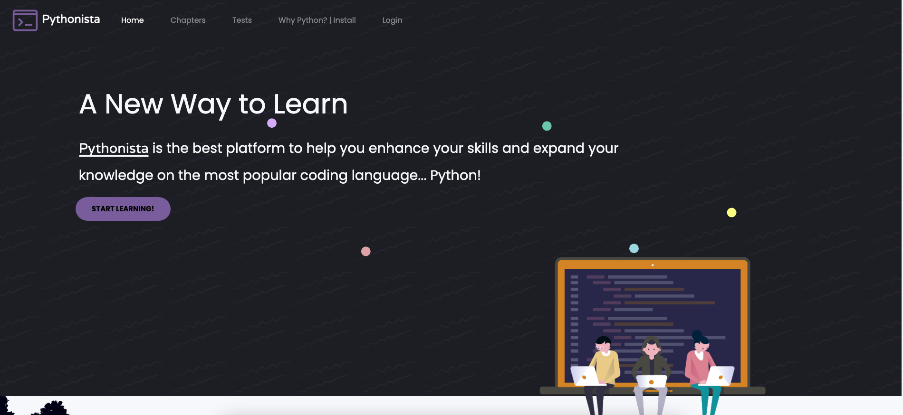

# Pythonista: Python Learning Platform

Welcome to the Python Learning Platform, a web application designed to help students improve their Python programming skills through a structured learning path. The platform provides resources at three difficulty levels: Beginner, Advanced, and Expert, with a progression system that includes tests, badges, and statistics tracking.
## Live Demo

The website is live and can be accessed here: [Python Learning Platform](https://antoniskarnavas.pythonanywhere.com/index).

## Features

### 1. Learning Material
- The material is divided into **three difficulty levels**: Beginner, Advanced, and Expert.
- Each level consists of **multiple chapters** to guide users through the learning process.
- **Chapter content** includes written material and programming concepts tailored to the user's level.

### 2. Testing and Progress
- After reading each chapter, students can take a test composed of **multiple-choice**, **true/false**, or **fill-the-gap** questions.
- **Passing score** is set at 60% or higher; failing requires the user to revisit the material before reattempting the test.
- On their **first login**, students can opt to take an initial test to be placed at the appropriate level. If they score well, they can **unlock chapters** and skip easier ones.
- **Progress** is rewarded with badges based on chapter completion and total score points.

### 3. User Profile
- **Profile pages** show progress, badges earned, and a breakdown of personal statistics.
- Track how far you’ve advanced through the chapters and view your **total accumulated score**.

### 4. Teachers' Role
- **Teachers** have special access to the platform:
  - Add test questions to any chapter.
  - Inspect all students' progress, including **detailed analytics and performance metrics**.
- To gain **teacher access**, email **antoniskarnavas@yahoo.com** with your request.

### 5. Feedback and Support
- If you encounter any issues, such as bugs, downtime, or you have suggestions for improvement, feel free to email **antoniskarnavas@yahoo.com** for assistance.

## Getting Started

1. **Sign up** as a student and start learning at your preferred difficulty level.
2. **Take tests** to evaluate your progress and move forward through the chapters.
3. Earn badges and track your **statistics** as you work through the material.
4. **Teachers** can request access to contribute to the content and track student performance.

## Technologies Used
- **Frontend**: HTML, CSS, JavaScript (JQuery)
- **Backend**: Flask (Python)
- **Database**: MySQL
